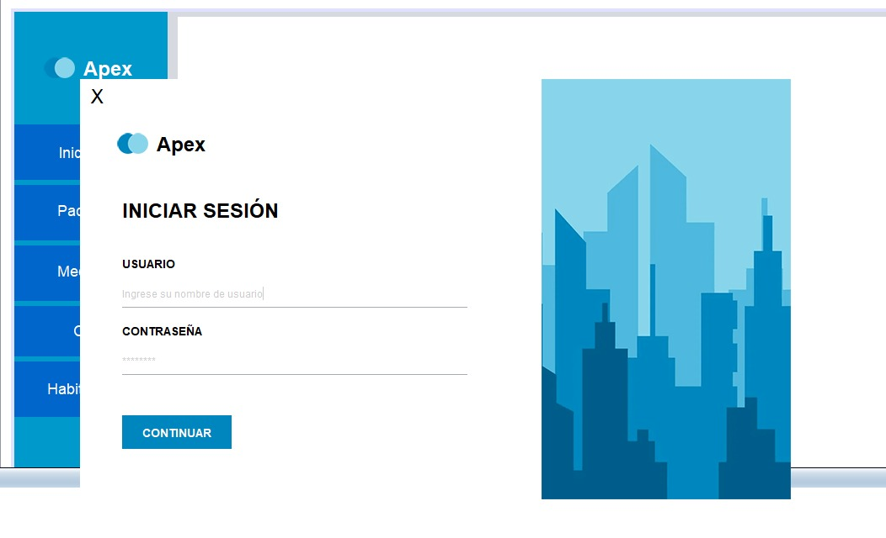

# Sistema de Gestión de Clínica - Java Swing  

Un sistema de gestión clínica desarrollado en **Java Swing**, con una interfaz moderna basada en **Material Design**. Diseñado para gestionar pacientes, médicos y citas, ofreciendo una experiencia eficiente y fácil de usar.  

---

## 📋 Características Principales  

✔️ **Interfaz Gráfica Modernizada**: Inspirada en los principios de diseño de Material Design.  
✔️ **Gestión de Citas**: Programa, reprograma, cancela y realiza seguimiento del estado de las citas.  
✔️ **Gestión de Pacientes y Médicos**: Registro, edición y visualización de datos esenciales.  
✔️ **Estados Personalizados**: Gestión flexible de estados como:  
   - *Programada*  
   - *Confirmada*  
   - *En Progreso*  
   - *Completada*  
   - *Cancelada*  
   - *Reprogramada*  
✔️ **Efectos Visuales**: Animaciones sutiles como hover y transiciones para mejorar la experiencia del usuario.  
✔️ **Barra de Cabecera Personalizada**: Incluye iconos personalizados para cerrar y minimizar ventanas.  

---

## 🌟 Vista Previa  

<p align="center">
  <kbd>
    
  </kbd>
</p>

---

## ⚙️ Requisitos  

- **Java 8 o superior**  
- IDE compatible (NetBeans, IntelliJ, Eclipse, etc.)  
- Base de datos configurada (MySQL recomendada)  

---

## 🚀 Cómo Usar  

1. Clona este repositorio en tu máquina local:  
   ```bash
   git clone https://github.com/programfive/sistemaClinica.git
